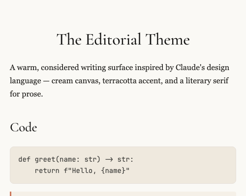
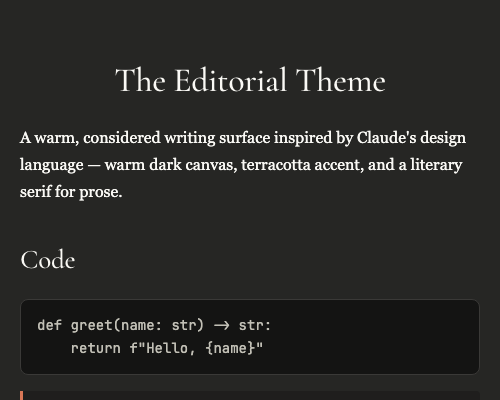

# Typora Claude Theme

A warm, editorial Typora theme inspired by Anthropic's Claude design language.

Two variants are included:

- **Claude** (`claude.css`) — cream canvas, terracotta coral accent
- **Claude Dark** (`claude-dark.css`) — warm dark surfaces, same coral accent

## Preview

**Claude** (light):

**Claude Dark**:

## Features

- Warm palette derived from Claude's design tokens — no cool gray, no pure white
- Editorial typography: serif prose (Georgia) and serif display headings (Cormorant Garamond), with CJK-friendly fallbacks (PingFang SC, Microsoft YaHei, Noto Sans CJK)
- Restrained syntax highlighting covering CodeMirror, Pygments, and GitHub Primer token sets
- Themed sidebar and UI chrome

## Installation

1. Download this repository.
2. Copy `claude.css` and `claude-dark.css` into Typora's theme folder (`Preferences → Appearance → Open Theme Folder`).
3. Restart Typora and select **Claude** or **Claude Dark** from the Themes menu.

## License

GPL-3.0
