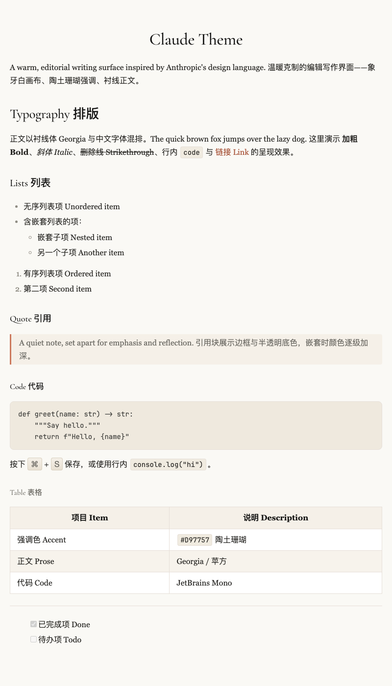
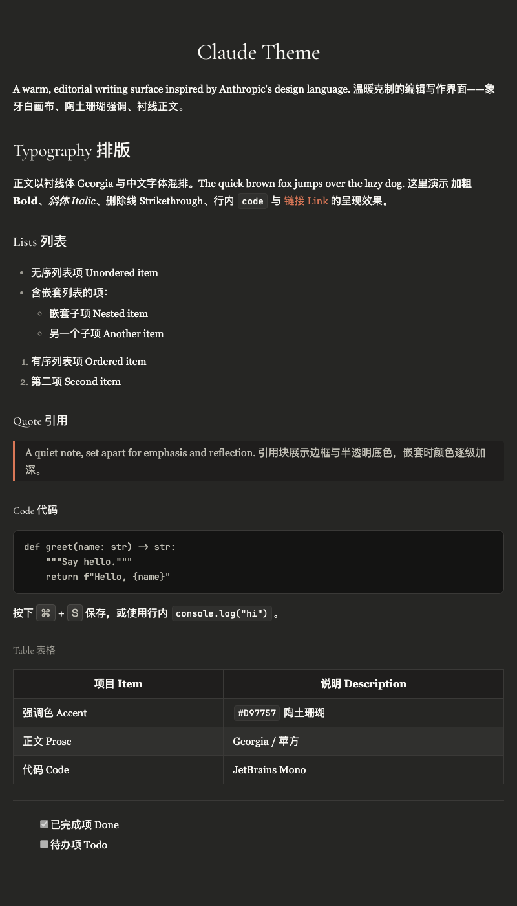

# Typora Claude Theme

A warm, editorial Typora theme inspired by Anthropic's Claude design language.

> Language: **English** · [简体中文](README_zh_cn.md)

Two variants are included:

- **Claude** (`claude.css`) — cream canvas, terracotta coral accent
- **Claude Dark** (`claude-dark.css`) — warm dark surfaces, same coral accent

## Preview

**Claude** — full style showcase (headings, lists, quote, code, table, CJK):

**Claude Dark**:

## Features

- Warm palette derived from Claude's design tokens — no cool gray, no pure white
- Editorial typography: serif prose (Georgia) and serif display headings (Cormorant Garamond), with CJK-friendly fallbacks (PingFang SC, Microsoft YaHei, Noto Sans CJK)
- Restrained syntax highlighting covering CodeMirror, Pygments, and GitHub Primer token sets
- Themed sidebar and UI chrome

## Typography & Font Substitutions

Claude's native interface uses three proprietary webfonts — `anthropic-serif`, `anthropic-sans`, and `anthropic-mono` — which are commercially licensed and cannot be redistributed with this theme. To reproduce the same look, this theme instead uses open-source and system fonts that follow Claude's own fallback chain.

| Role | Claude native | Substitution used here | License / Source |
|---|---|---|---|
| Prose (response text) | `anthropic-serif` (Tiempos Text) | **Georgia** | System font — first entry in Claude's own `serif` fallback |
| Display headings | Copernicus (slab serif) | **Cormorant Garamond** | Open source (SIL OFL) |
| Code | `anthropic-mono` | **JetBrains Mono** | Open source (SIL OFL) |
| UI chrome | Styrene B | system-ui / PingFang SC | System font |
| CJK text | PingFang SC / Microsoft YaHei / Noto Sans CJK SC | Same | System font |

### Why headings use weight 500

Cormorant Garamond is a fine garalde — noticeably thinner than Copernicus, which is a heavy slab serif. The theme compensates by setting headings to weight **500**, with slightly larger sizes and negative letter-spacing, closing the visual-weight gap while keeping the serif elegance.

### Optional fonts for the closest match

The theme works out of the box using only system fonts. For the closest match to Claude, install these two open-source fonts:

- **[Cormorant Garamond](https://github.com/CatharsisFonts/Cormorant)** — display headings (falls back to `EB Garamond`, then `Georgia` if absent)
- **[JetBrains Mono](https://www.jetbrains.com/lp/mono/)** — code blocks (falls back to `Source Code Pro`, `SF Mono`, `Menlo`, etc.)

> **Note on variable fonts:** if you install Inter (or another font) for customization, use the **static** weights rather than the variable `.ttf`. Chromium-based renderers — including Typora — may fail to resolve specific weights (400/500/600) from a variable file and silently fall back to the system font.

## Installation

1. Download this repository.
2. Copy `claude.css` and `claude-dark.css` into Typora's theme folder (`Preferences → Appearance → Open Theme Folder`).
3. Restart Typora and select **Claude** or **Claude Dark** from the Themes menu.

## License

GPL-3.0
